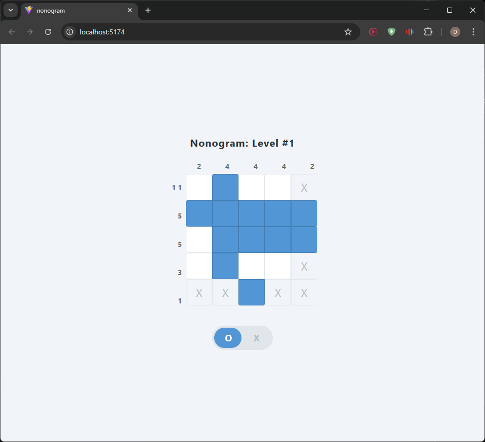
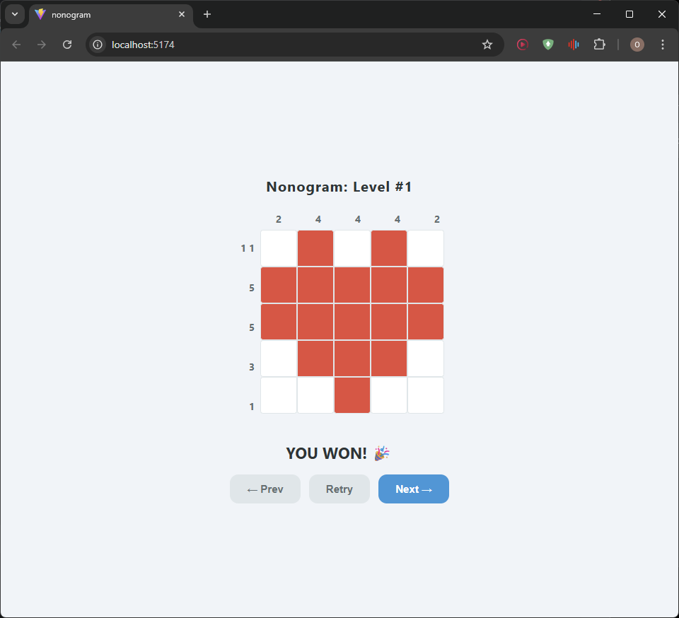

# 🧩 Nonogram

A nonogram puzzle game built with React and Vanilla JS. Solve logic puzzles and reveal colorful pixel art when you win!

## Screenshots




## What is a Nonogram?

Nonogram is a logic puzzle where you fill in cells on a grid based on number clues on the sides. The numbers tell you how many consecutive filled cells there are in each row and column — with at least one empty cell between each group.

For example, a clue of `2 3` means there are 2 filled cells, then a gap, then 3 filled cells.

Each cell has three states:
- **Empty** — untouched cell (default)
- **Filled (O)** — cell you marked as filled
- **Crossed (X)** — cell you marked as definitely empty

You win when all the correct cells are filled — crossed and empty cells on the rest don't matter!

## Features

### 5 Handcrafted Levels
Each level is a 5x5 grid that reveals a colorful pixel art image on completion — heart, house, sun, fish, and diamond, each with unique colors.

### Drag to Fill / Cross
Hold the mouse button and drag across multiple cells to fill or cross them all at once. Dragging in Fill mode won't overwrite crossed cells, and dragging in Cross mode won't overwrite filled cells.

### Auto-Fill
When all the filled cells in a row or column are correctly placed, the remaining empty cells in that row/column are automatically crossed out with X. This helps you focus on the unsolved parts of the puzzle. You can still freely change any cell even after auto-fill.

### Fill / Cross Toggle
Switch between Fill mode (O) and Cross mode (X) using the toggle switch at the bottom. The active mode is highlighted in blue.

### Color Reveal on Win
When you complete a level, the grid animates and reveals the pixel art in full color.

### Level Navigation
After completing a level, use the **Prev**, **Retry**, and **Next** buttons to navigate between levels.

## Tech Stack

- **React** — UI and state management
- **Vanilla JS** — all game logic (no external libraries)
- **CSS** — styling with no UI frameworks
- **Vite** — build tool and dev server

## Project Structure

```
src/
├── app/
│   └── App.jsx              # root component, ties everything together
├── components/
│   ├── Board/
│   │   ├── Board.jsx        # renders the 5x5 grid
│   │   ├── Cell.jsx         # single cell with empty/filled/crossed states
│   │   └── board.css
│   ├── Hints/
│   │   ├── ColHints.jsx     # column hint numbers above the board
│   │   ├── RowHints.jsx     # row hint numbers left of the board
│   │   └── hints.css
│   └── UI/
│       ├── Button.jsx       # reusable button component
│       ├── Toolbar.jsx      # fill/cross toggle switch
│       └── ui.css
├── hooks/
│   └── useNonogram.js       # all game state and logic (useState, useEffect, useRef)
├── levels/
│   └── levels.json          # 5 levels with solution matrix and color matrix
├── logic/
│   ├── autoFill.js          # auto-crosses empty cells in completed rows/columns
│   ├── checkWin.js          # checks if all filled cells match the solution
│   └── hintCalculator.js    # calculates hint numbers from a row or column
└── styles/
    └── index.css
```

## How the Logic Works

**`hintCalculator.js`** takes a single row or column as an array and returns the group sizes. For example `[0, 1, 1, 0, 1]` → `[2, 1]`.

**`checkWin.js`** compares the player's grid to the solution — returns true only if every cell that should be `1` in the solution is `1` in the player's grid.

**`autoFill.js`** scans each row and column after every move. If all `1`s in a row/column are correctly filled, it fills the remaining `0` cells with `2` (X).

**`useNonogram.js`** is the central hook that manages all state: current level, player grid, active mode, win state, and drag tracking via `useRef`.

## Getting Started

```bash
npm install
npm run dev
```

Open [http://localhost:5173](http://localhost:5173) in your browser.